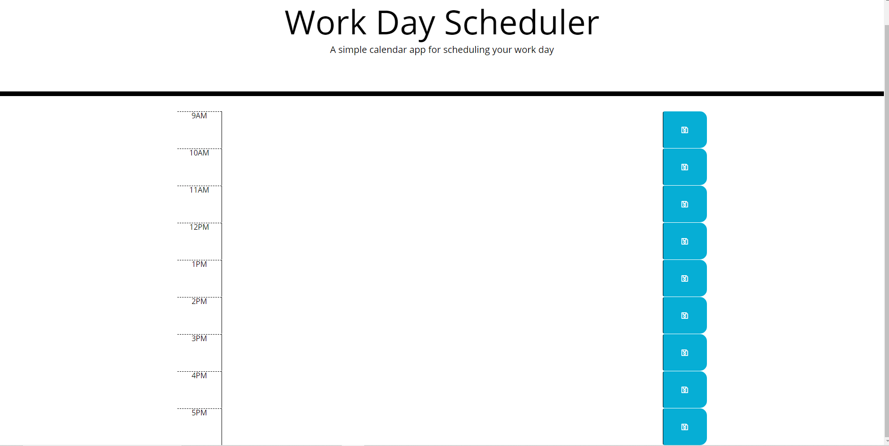

<details open="open">
  <summary><h2 style="display: inline-block">Table of Contents</h2></summary>
  <ol>
    <li>
      <a href="#about-the-project">About The Project</a>
      <ul>
        <li><a href="#built-with">Built With</a></li>
      </ul>
    </li>
    <li>
      <a href="#getting-started">Getting Started</a>
      <ul>
        <li><a href="#prerequisites">Prerequisites</a></li>
        <li><a href="#installation">Installation</a></li>
      </ul>
    </li>
    <li><a href="#usage">Usage</a></li>
    <li><a href="#license">License</a></li>
    <li><a href="#contact">Contact</a></li>
    <li><a href="#acknowledgements">Acknowledgements</a></li>
  </ol>
</details>
 


## About The Project


format: 

Day planner

Use this day planner to plan you day!

### Built With

* [https://jsoh11.github.io/Jordan-dayplanner/]()
* [https://github.com/jsoh11/Jordan-dayplanner.git]()
* [jordansoh14@gmail.com]()


<!-- GETTING STARTED -->
## Getting Started

To get a local copy up and running follow these simple steps.

### Prerequisites

This is an example of how to list things you need to use the software and how to install them.
* Gitbash
* VS code

### Installation

1. Clone the repo
   ```sh
   git clone git@github.com:jsoh11/Jordan-dayplanner.git
   ```


## Usage

A planner to plan your day!


## License

Distributed under the MIT License. See `LICENSE` for more information.


## Contact

Jordan soh - [@email](jordansoh14@gmail.com) - email

Project Link: [Repo](https://jsoh11.github.io/Jordan-dayplanner/)


## Acknowledgements

* [othneildrew README template](https://github.com/othneildrew/Best-README-Template)
